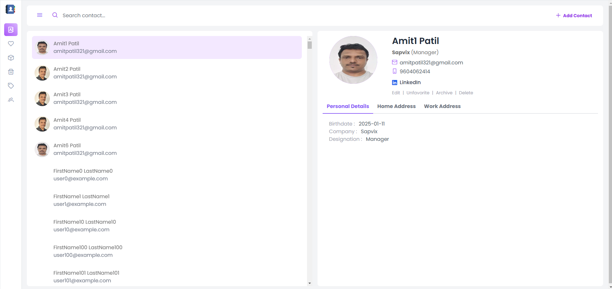
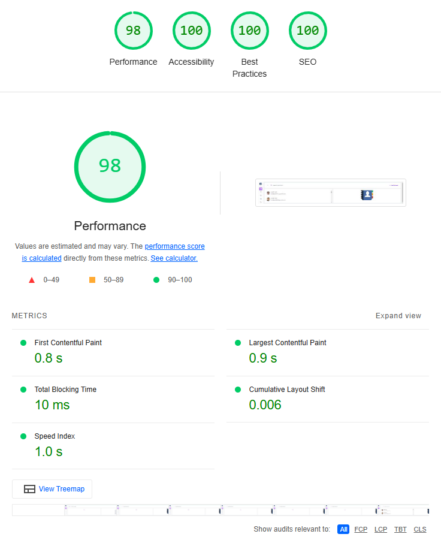

# Contact Book

Simple contact Book application

## Tech Stack
1) React
2) Typescript
3) Vite
4) Zustand
5) Supabase
6) Prime React
7) Tailwind

## Preview and Lighthouse Report

## Instructions to run
1) git clone
2) git install
3) Create .env file and then provide

VITE_SUPABASE_URL = "your_domain.supabase.co"
VITE_SUPABASE_KEY = your_api_key
