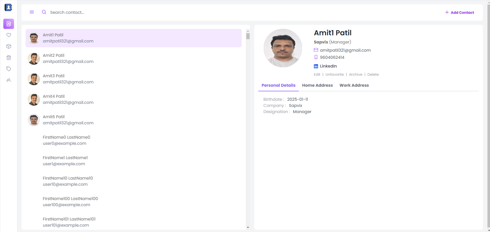
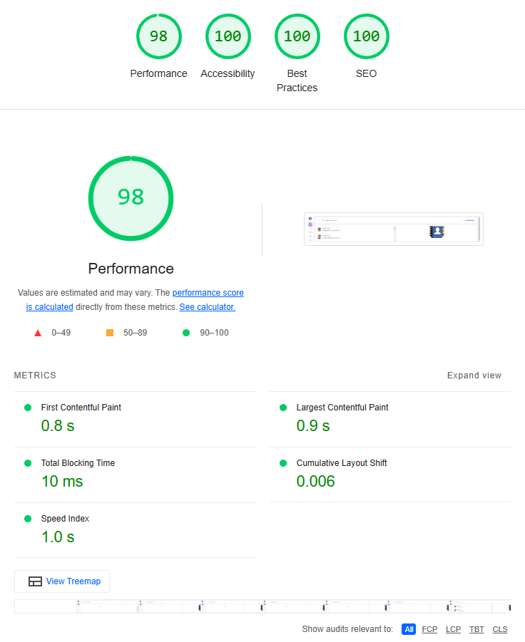

# 📖 Contact Book

A **simple and efficient** contact book application built with modern web technologies.

## 🚀 Tech Stack
This project leverages the following technologies:

- ⚛ **React** – Declarative and efficient UI library  
- 🏗 **TypeScript** – Type-safe development  
- ⚡ **Vite** – Fast and optimized build tool  
- 🌿 **Zustand** – Lightweight state management  
- 🛢 **Supabase** – Backend as a service (BaaS)  
- 🎨 **PrimeReact** – Rich UI components for React  
- 🎨 **Tailwind CSS** – Utility-first CSS framework  

## 📷 Application Preview


A sleek and responsive UI built with **PrimeReact** and **Tailwind CSS**, ensuring a **modern and intuitive** user experience.

## 📊 Lighthouse Report
This application is optimized for **performance, accessibility, and best practices**.



✅ **Performance**: `98`  
✅ **Accessibility**: `100`  
✅ **SEO**: `100`  
✅ **Best Practices**: `100`  

Thanks to **Vite**, **lazy loading**, and efficient state management, the app delivers **blazing-fast performance** and **SEO-friendly pages**. 🚀

## 🛠️ Installation & Setup
Follow these steps to run the project locally:

```sh
# Clone the repository
git clone https://github.com/amitpatil321/contact-book.git

# Navigate to the project directory
cd contact-book

# Install dependencies
npm install

# Start the development server
npm run dev
```

## 🤝 Contributing
Contributions are welcome! If you find a bug or have a suggestion, feel free to open an issue or submit a pull request.

## 📄 License
This project is licensed under the MIT License.

